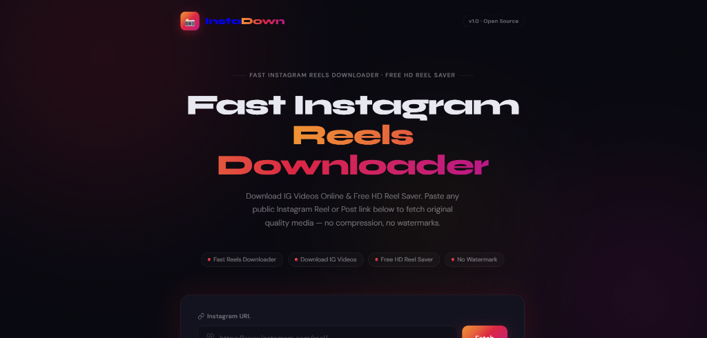

# InstaDown 📸
> **Fast Instagram Reels Downloader & Free HD Video Saver** — Built with Flask, Instaloader, and a modern dark UI.

🌐 **Live Website**: [https://instagram-story-downloader.onrender.com/](https://instagram-story-downloader.onrender.com/)


<br/>



---

## ✨ Features
- ⚡ **Instant Metadata Fetch**: Fetch media owner, caption preview, likes count, and high-res thumbnail before downloading.
- 📹 **Reels & Video Downloads**: Download public Instagram Reels and IGTV videos in high quality (`.mp4`).
- 🖼️ **Photo & Carousel Support**: Download post images and carousel items (`.jpg`).
- 🎨 **Modern Dark UI**: Designed with glassmorphism, Instagram-inspired gradients, interactive loading animations, and Google Fonts (`Syne` + `DM Sans`).
- 🔒 **Privacy Focused**: Direct media streaming without permanent server-side file retention.

---

## 🛠️ Tech Stack
- **Backend**: Python 3, Flask 3.0+, Instaloader 4.15+, Gunicorn
- **Frontend**: Vanilla JavaScript (ES6+), Modern CSS (Custom Properties & Flex/Grid), HTML5

---

## 🚀 Quick Start (Local Development)

### 1. Clone the repository
```bash
git clone https://github.com/KisholoyDD21/Instagram-story-Downloader.git
cd Instagram-story-Downloader
```

### 2. Set up virtual environment
```bash
# Windows
python -m venv .venv
.venv\Scripts\activate

# macOS / Linux
python3 -m venv .venv
source .venv/bin/activate
```

### 3. Install dependencies
```bash
pip install -r requirements.txt
```

### 4. Run the application
```bash
python app.py
```
Open your browser and navigate to `http://127.0.0.1:5000`.

---

## 🌐 Deployment Instructions

### Option 1: Deploy on Render.com (Recommended)
1. Fork or push this repository to your GitHub account.
2. Sign in to [Render](https://render.com) and click **New > Web Service**.
3. Connect your GitHub repository `Instagram-story-Downloader`.
4. Configure service settings:
   - **Environment**: `Python 3`
   - **Build Command**: `pip install -r requirements.txt`
   - **Start Command**: `gunicorn app:app`
5. Click **Create Web Service**.

### Option 2: Deploy with Docker / Railway / Fly.io
This project includes a production-ready `Dockerfile`.

```bash
# Build Docker image
docker build -t instadown .

# Run container
docker run -p 5000:5000 instadown
```

---

## 📡 API Reference

### 1. Fetch Post Metadata
```http
POST /api/info
Content-Type: application/json

{
  "url": "https://www.instagram.com/reel/EXAMPLE_SHORTCODE/"
}
```

### 2. Download Media File
```http
POST /api/download
Content-Type: application/json

{
  "url": "https://www.instagram.com/reel/EXAMPLE_SHORTCODE/"
}
```

---

## 📝 License
This project is open source under the [MIT License](LICENSE).
